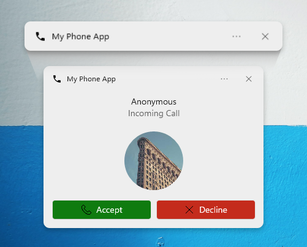

# toasted

Toast notifications library for Windows. Unlike other Windows toast libraries, Toasted is the one of the most comprehensive toast libraries as it supports all elements (images, progress bars, texts, inputs, buttons...) that you probably never seen on a toast. Not only that, it also wraps useful features found in the Notifications API.

> Struggling with making a GUI for your script? Say no more.


<sup>[Photo](https://unsplash.com/photos/qUP1ws-mzhw) by Oleg Laptev from Unsplash</sup>

## Install

```
python -m pip install toasted
```

## Example

```py
import asyncio
from typing import Dict
from toasted import Toast, Text, ToastResult

# Create Toast with Toast(),
# see docstring for all available parameters.
mytoast = Toast()

# Add elements.
mytoast += Text("Hello world!")           # Using += operator.
mytoast.data.append(Text("Hello world!")) # Or access the inner list with Toast.data.

# Set up a handler.
# This handler will be executed when toasted has clicked or dismissed.
@mytoast.handler
def myhandler(ctx : ToastResult):
    if not ctx.is_dismissed:
        print("Got arguments:", ctx.arguments)
    else:
        print("Toast has dismissed with reason", ctx.dismiss_reason)

# Run show() async function. show() function returns ToastResult
# like handler, if you prefer to access toast result inline.
asyncio.run(mytoast.show())
```

## Features

### HTTP images

Normally, Windows restricts the use of HTTP images and only allows local file paths on non-UWP applications. But to overcome the limitation, Toasted downloads HTTP images to %TEMP%, so you can now use images from web without any configuration! Downloaded images are deleted once toast has dismissed / clicked. Also, to comply with Windows API, you can enable sending system information (such as `ms-lang`, `ms-theme`, `ms-contrast`) to remote sources as query parameters by setting `add_query_params` property.

### Custom icon and name

In Windows, notifications are bound to an installed application in system. So, when you tell Windows that you are sending notifications from Python executable, it will always use Python executable's name and icon. However, if you register a new application in Windows, you can set a custom icon and name.

```py
from toasted import Toast, Text

# Applications can be registered outside of Python since it just adds registry keys to Windows.
# This is just a shortcut method to do that.
# https://learn.microsoft.com/en-us/windows/apps/design/shell/tiles-and-notifications/send-local-toast-other-apps
Toast.register_app_id("MyOrg.MyDomain.MyPhone", "My Phone App")

mytoast = Toast(source_app_id = "MyOrg.MyDomain.MyPhone")
...
```



Since applications are registered in Windows Registry, this will leave traces in system even after Python is no longer running. You can unregister the application by `unregister_app_id()` method.

### Custom sounds

If an custom sound has provided, toast's own sound will be muted and Python's `winsound` module will be used instead. Also, sounds from HTTP sources are supported too.

### Update toast content (Data binding)

Properties in toast elements can have a binding/dynamic/reference value, which is done by simply putting a key surrounded with curly braces like, `{myProgress}`. Then, you can set a new value for `myProgress` key before showing toast with `show()`, and with `update()` to update toast in-place without showing a new toast.

This is useful for updating toast progress bars without displaying a new toast for each step.

### Import from JSON

Notification elements and their properties can be imported with dictionaries (JSON-accepted types) with `Toast.from_json()`, so you can add more than one element by calling a single method. See example JSON configurations [here.](examples)

## Building

```
python -m pip wheel .
```

## License

Source code is licensed under MIT license. You must include the license notice in all copies or substantial uses of the work.