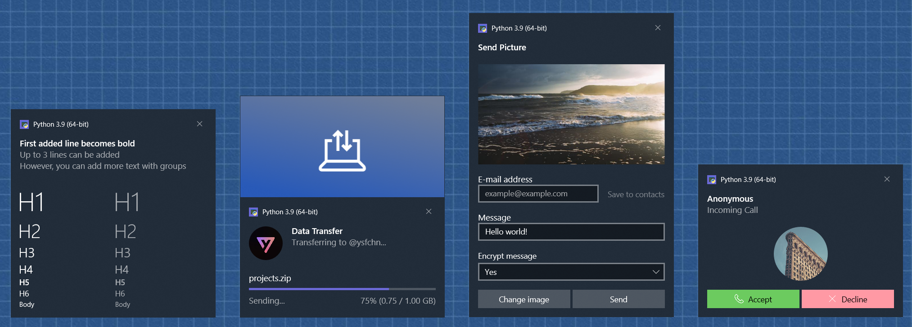

# toasted

Toast notifications library for Windows. Unlike other Windows toast libraries, Toasted is the one of the most comprehensive toast libraries. Because it supports all elements (images, progresses, texts, inputs, buttons...) that you probably never seen on a toast. Not only that, it also includes useful features found in the Notifications API.

> Struggling with making a GUI for your script? Say no more.



## Install

```
python -m pip install toasted
```

## Example

```py
import asyncio
from typing import Dict
from toasted import Toast, Text

# Create Toast with Toast(),
# see docstring for all available parameters.
mytoast = Toast()

# Add elements.
mytoast += Text("Hello world!")           # Using += operator.
mytoast.data.append(Text("Hello world!")) # Or access the inner list with Toast.data.

# Set up a handler.
# This handler will be executed when toasted has clicked or dismissed.
@mytoast.handler
def myhandler(arguments : str, user_input : Dict[str, str], dismiss_reason : int):
    # dismiss_reason will set to a value higher than or equals to 0 when dismissed,
    # -1 means a toast or button click.
    if dismiss_reason == -1:
        print("Got arguments:", arguments)
    else:
        print("Toast has dismissed:", dismiss_reason)

# Run show() async function.
asyncio.run(mytoast.show())
```

## Highlights

* **Remote (HTTP) images support**
    <br>Normally, Windows restricts the use of HTTP images and only allows local file paths on non-UWP applications. But to overcome the limitation, Toasted downloads HTTP images to %TEMP%, so you can now use images from web without any configuration! Downloaded images are deleted once toast has dismissed / clicked. Also, to comply with Windows API, you can enable sending system information (such as `ms-lang`, `ms-theme`, `ms-contrast`) to remote sources as query parameters by setting `add_query_params` property.

* **Custom sounds**
    <br>If an custom sound has provided, toast's own sound will be muted and Python's `winsound` module will be used instead. Also, sounds from HTTP sources are supported too.

* **Update toast content (Data binding)**
    <br>Properties in toast elements can have a binding/dynamic/reference value, which is done by simply putting a key surrounded with curly braces like, `{myProgress}`. Then, you can set a new value for `myProgress` key before showing toast with `show()`, and with `update()` to update toast in-place without showing a new toast.

* **Import from JSON**
    <br>Notification elements and their properties can be imported with dictionaries (JSON-accepted types) with `Toast.from_json()`, so you can add more than one element by calling a single method. See example JSON configurations [here.](examples)
    
## Notes

* As you can see from screenshot, it is not possible to change "Python" title in normal ways, since Windows requires a "source application" to show notifications from. However, [Toast collections](https://docs.microsoft.com/en-us/windows/apps/design/shell/tiles-and-notifications/toast-collections) allows to override app icon, but I'm not sure how I can implement this (or even, is it possible for a non-UWP app?), so still working on it.
