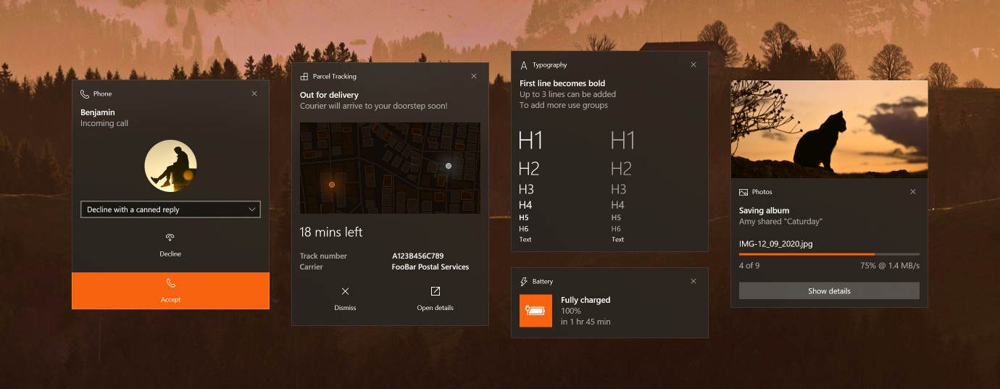

# toasted

Yet another notifications library for Windows, written in Python, built using Windows Runtime APIs (WinRT).

Compared to other toast libraries, Toasted supports all notification elements provided by Windows, such as; inputs, selects, buttons, images, different text styles... so you are not just limited to single line of text.

Since Windows **restricts use of some features of toast notifications in unpackaged non-UWP apps**, Toasted also handles this cases _in the best way possible_ to mimic the behaviour of UWP apps, for example; HTTP(S) URIs are first downloaded to a temporary directory and then used as a local file, Windows URIs like `ms-appx` and `ms-appdata` are set relative to special directories [and so on.](#special-behaviours)



It works and has been tested on Windows 10 and 11, but early builds of Windows 10 may not work as the Notification APIs used in the library are initially introduced in these builds with fewer features. Future releases of Windows should also expected to work as-is due to Microsoft's commitment to making Windows backwards-compatible.

> I'm using Linux in my daily life, and the reason why I created this library even I use Linux is that I started working on this library before my switch to Linux. So I currently use a separate Windows device to develop Toasted on, which may affect my development time. Therefore, while I'm trying to do my best and keep the library updated, do not expect regular updates.

If other systems would provide APIs and features to create rich libraries as on Windows, I would have love to add support for other systems, but as the library is focusing/relying on Windows APIs more in each update, it is not possible to make it cross-platform at the moment.

Toast notifications can also be preferred to develop rapid GUIs for your Windows-only Python projects.

## Install

```
python -m pip install toasted
```

## Usage

See [`showcase.py`](./examples/showcase.py) for an introduction to the library with detailed example toast notification configurations.

## Special behaviours

Windows API restricts use of some features of toast notifications for non-UWP/non-packaged apps, Toasted contains bunch of conveinence features to mimic the behaviour of UWP apps and get the most of the toast features of Windows.

### Remote images (HTTP URIs as image sources)

Normally, Windows restricts the use of HTTP images and only allows local file paths on non-UWP applications. But to overcome the limitation, Toasted downloads HTTP images to `%TEMP%` and replaces the link with downloaded local file before showing the toast. Downloaded files **are deleted** once toast has dismissed/clicked to not leave traces on the system.

Also, to comply with Windows API, you can enable sending system theme information (such as `ms-lang`, `ms-theme`, `ms-contrast`) to given URLs as query parameters by setting `add_query_params` property, so if you are serving files from your web server, you can serve different images based on the system theme.

### Application icon and name (app IDs)

Notifications in Windows must be bound to an **application registered in system.** So, when you tell Windows that you are sending notifications from Python executable, it will send the toast **on behalf of the given application,** thus the application's own name and icon will appear in the toast title.

If you don't set a custom `app_id`, it will use the path where Python has installed. (`sys.executable`) But note that this won't work with virtual environments as there won't be a Python that registered on the system.

However Toasted provides a `register_app_id()` method to register a new "App ID" (or AUMID) in `Foo.Bar.Example` format to the Windows Registry, so you can use your own app ID in your toasts and Windows will show on behalf of your app ID, so you can set the application icon and name as you wish.

Registering an app ID doesn't require a reboot on the system, so you can register an app ID just before sending a toast, however, **you need to make sure that all notifications sent by Toasted are cleared from Action Center** to make Windows to use the updated application icon and name.

```py
from toasted import Toast, Text

# Applications can be registered outside of Python since it just adds registry keys to Windows.
# This is just a shortcut method to do that.
# https://learn.microsoft.com/en-us/windows/apps/design/shell/tiles-and-notifications/send-local-toast-other-apps
app_id = Toast.register_app_id("MyOrg.MyDomain.MyPhone", "My Phone App")

# Setting app_id property causes Python to tell Windows that the currently running process is running 
# under the specified application ID (MyOrg.MyDomain.MyPhone) instead of Python executable.
# If an app_id has not set, the default app_id is used which is sys.executable.
mytoast = Toast(app_id = app_id)

# Or you can change app_id later instead of constructor.
mytoast.app_id = app_id
```

> [!WARNING]
> Since these app ID registrations are made in Windows Registry, this will leave traces in system even after your Python program is no longer running. You can unregister the application by `unregister_app_id()` method.

### Custom sounds

If an custom sound has provided, toast's own sound will be muted and Python's `winsound` module will be used instead. Also, sounds from HTTP sources are supported too instead of just file paths.

### Use images of Windows system icons

Toasted can create images of Unicode characters in Windows icon fonts ([Segoe Fluent](https://learn.microsoft.com/en-us/windows/apps/design/style/segoe-fluent-icons-font) and [Segoe MDL2](https://learn.microsoft.com/en-us/windows/apps/design/style/segoe-ui-symbol-font)) with `get_icon_from_font()` utility method.

A custom URI has also been added for convenience, for example if you set `icon://E706` as a source in image element, it will show a screen brightness icon (`U+E706`) from "Segoe MDL2" (pre-installed on Windows 10 and up) or "Segoe Fluent" (pre-installed on Windows 11 and up) font. Toasted will prefer using MDL2 font if it is running on Windows 10, or Fluent, if running on Windows 11.

## Advanced

### Update toast content (Data binding)

Properties in toast elements can have a binding value, which is done by simply putting a key surrounded with curly braces like, `{myProgress}`. Then, you can set a new value for `myProgress` key with `show()` to set its initial value and with `update()` to update toast in-place without showing a new toast.

This is useful for updating toast progress bars without displaying a new toast for each step. Since data binding is a feature provided by Windows API itself, not all elements may support this feature, so Toasted has no control over this.

## Unimplemented features

My initial goal was to bring most if not all toast features to Python, but unfortunately there are some notification features that are not supported/implemented on this library. Below is a non extensive list of these:

* [Collections](https://learn.microsoft.com/en-us/windows/apps/design/shell/tiles-and-notifications/toast-collections)
* [Pending updates & background events](https://learn.microsoft.com/en-us/windows/apps/design/shell/tiles-and-notifications/toast-pending-update?tabs=builder-syntax), seems to require a COM server.

## Building

```
python -m pip wheel .
```

Or if you use [rye](https://rye-up.com/), `rye build`.

## License

Source code is licensed under MIT license. You must include the license notice in all copies or substantial uses of the work.